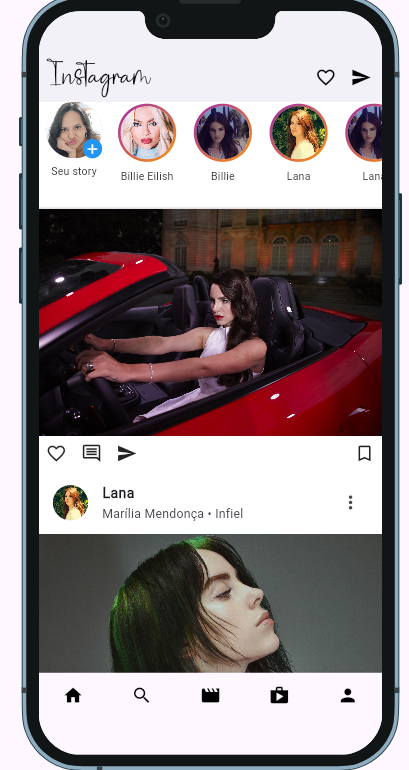

# Instagram Clone

Projeto Flutter que recria a interface principal do aplicativo Instagram, incluindo stories, feed e barra de navegação inferior.

---

## Estrutura do Projeto

```

instagram_clone/
├── assets/
│   ├── post1.jpg
│   ├── post4.jpg
│   ├── post5.jpg
│   ├── story.jpg
├── fonts/
│   └── Billabong.otf
├── docs/
│   └── preview.png       ← screenshot do app
├── lib/
│   └── main.dart
├── pubspec.yaml
└── README.md

````

---

## Funcionalidades

- Stories fixos no topo da tela, incluindo "Seu story"
- Feed com cards de posts (avatar, nome, imagem, ações)
- Foto de perfil no canto esquerdo de cada post
- Barra inferior de navegação fixa
- Interface responsiva usando Device Preview
- Layout fiel ao Instagram original

---

## Tecnologias e Técnicas Utilizadas

- Flutter e Dart
- Widgets: `ListView.builder`, `Stack`, `CircleAvatar`, `BottomNavigationBar`
- Layouts responsivos: `Expanded`, `Column`, `Row`, `SizedBox`
- Gradiente nos stories
- Device Preview para simulação em múltiplos dispositivos
- Boas práticas de UI/UX: alinhamento, tipografia e espaçamento
- Modularização futura possível, mantendo o código limpo e organizado

---

## Captura de Tela



---

## Como Executar o Projeto

### 1. Clonar o repositório
```bash
git clone https://github.com/lualys/instagram_clone.git
cd instagram_clone
````

### 2. Instalar dependências

```bash
flutter pub get
```

### 3. Executar no emulador ou dispositivo

```bash
flutter run
```

---

## Contato

Desenvolvido por **Luana Silva Figueiredo**
Email: [luanasilvafigueiredo999@gmail.com](mailto:luanasilvafigueiredo999@gmail.com)

